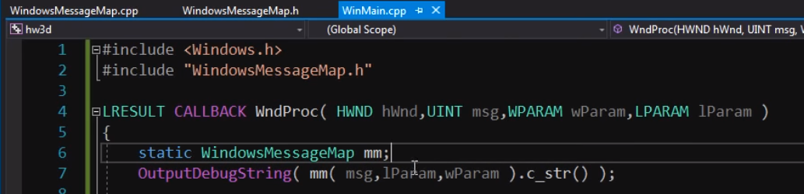

# Windows Message Lookup Table

A simple function + lookup table in pure C to help print the names
and `WPARAM` / `LPARAM` values of `WM_*` messages (and some others)
sent to a Windows Desktop application by the operating system.

Useful for debugging.

It only does the first `0x400` messages defined by Windows,
there are others in the header that can be enabled, but they are
subsystem specific.

## Import It

```c
extern "C" const TCHAR * const WindowsMessageLookup(UINT message);
```

## Use It (with UNICODE defined)

```c
wprintf(L"%04x: %32s WP: %016x  LP: %016x\n", uMsg, WindowsMessageLookup(uMsg), wParam, lParam);

std::wcout << std::format(L"{:04x}: {:32} WP: {:016x}  LP: {:016x}\n", uMsg, WindowsMessageLookup(uMsg), wParam, lParam) << std::endl;

OutputDebugString(std::format(L"{:04x}: {:32} WP: {:016x}  LP: {:016x}\n", uMsg, WindowsMessageLookup(uMsg), wParam, lParam).c_str());
```

## License

Public Domain, do what you want with it.

## References

- https://wiki.winehq.org/List_Of_Windows_Messages
- https://blog.airesoft.co.uk/2009/11/wm_messages/

## Why?

No disrespect to the author that inspired me to write this,
but the following code made my eyes bleed.

- non-`const` use of `unordered_map`
- O(N) vs. O(1) lookups 🤷🏻‍♂️
- `iostreams` was the worst thing to ever happen to console I/O besides
  Windows using `wchar_t` instead of UTF-8


